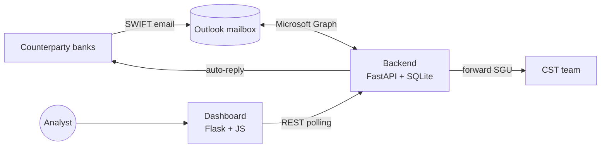
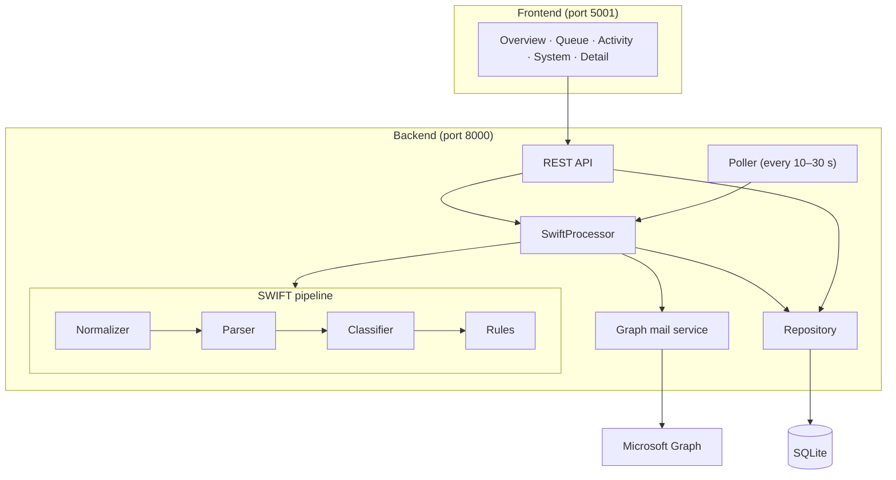
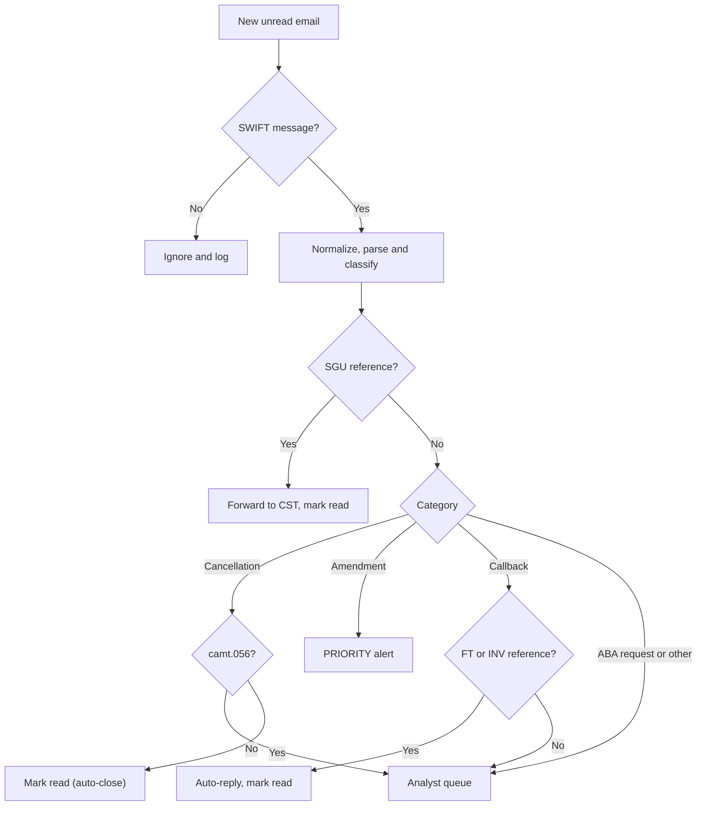

# SWIFT Mailbox Monitor: Solution Architecture

## 1. Overview

SGNY's shared SWIFT mailbox receives 200+ SWIFT messages a day, and analysts currently triage them by hand. SWIFT Mailbox Monitor automates this. It:

- **Reads** the Outlook mailbox continuously through Microsoft Graph.
- **Extracts** the key fields from MT and MX messages, including OCR'd text.
- **Classifies** each message using standard-library Python only.
- **Acts** on the business rules: forward, mark read, auto-reply or queue for an analyst.
- **Alerts** analysts in real time on a dashboard.

## 2. System context

## 3. Component architecture

| Component | Role |
| --- | --- |
| Normalizer | Fixes OCR errors in the message text |
| Parser | Reads MT and MX messages and extracts the fields |
| Classifier | Scores the category using keywords, fuzzy matching and the message type |
| Rules | Decides the action, status and priority |
| SwiftProcessor | Runs each message through the pipeline and performs the actions |
| Poller | Triggers a mailbox check on a fixed interval |
| Repository | Stores results in SQLite |
| REST API | Serves dashboard data and analyst updates |

## 4. Message processing flow

## 5. Business rules

| Message | Action | Status |
| --- | --- | --- |
| Not a SWIFT message | Ignore | IGNORED |
| SGU reference | Forward to CST, mark read | ROUTED_CST |
| Cancellation (camt.056) | Analyst queue, high priority | ACTION_REQUIRED |
| Cancellation (other, strong evidence) | Mark read | AUTO_CLOSED |
| Cancellation (weak evidence) | Analyst queue | ACTION_REQUIRED |
| Amendment | Priority alert | PRIORITY |
| Callback with FT or INV reference | Auto-reply, mark read | RESPONDED |
| Callback without FT or INV | Analyst queue | ACTION_REQUIRED |
| ABA request or other | Analyst queue | ACTION_REQUIRED |

Analysts click **Start** to move a queued item to IN_PROGRESS, then **Resolve** to close it.

## 6. Data model

| Table | Purpose |
| --- | --- |
| processed_messages | Audit log: one row per email, with the action and outcome |
| swift_actions | Work queue: one row per SWIFT reference, with the extracted fields |

## 7. Key API endpoints

| Method | Endpoint | Purpose |
| --- | --- | --- |
| GET | /api/swifts | Work queue |
| GET | /api/swifts/alerts | Priority alerts |
| GET | /api/swifts/metrics | Dashboard counts |
| GET | /api/swifts/{reference} | SWIFT detail |
| PATCH | /api/swifts/{reference} | Start or resolve an item |
| POST | /api/process/run | Check the mailbox now |
| GET | /api/process/log | Activity log |

## 8. Reliability and security

- **Idempotent:** each email is processed only once.
- **Resumable:** each step is saved as it completes, so after a failure the system never forwards or replies twice.
- **Single run:** only one mailbox check runs at a time.
- **Dry-run mode:** classifies messages without changing the mailbox.
- **Sign-in:** uses delegated Microsoft permissions, with no stored client secret.
- **Untrusted email content:** escaped in the UI, and the backend accepts requests only from the dashboard.

## 9. Technology stack

| Layer | Technology |
| --- | --- |
| Backend | Python, FastAPI |
| Mail integration | Microsoft Graph, MSAL |
| NLP | Python standard library (re, difflib, unicodedata) |
| Database | SQLite |
| Frontend | Flask, HTML, CSS, JavaScript |
| Testing | pytest (427 tests), Playwright browser checks |

## 10. Path to production

| Area | Hackathon | Production |
| --- | --- | --- |
| Change detection | Polling | Graph webhooks |
| Database | SQLite | Managed SQL database |
| Mailbox access | Delegated sign-in | Application permissions, scoped to the mailbox |
| Hosting | Local machine | Containers with single sign-on |
