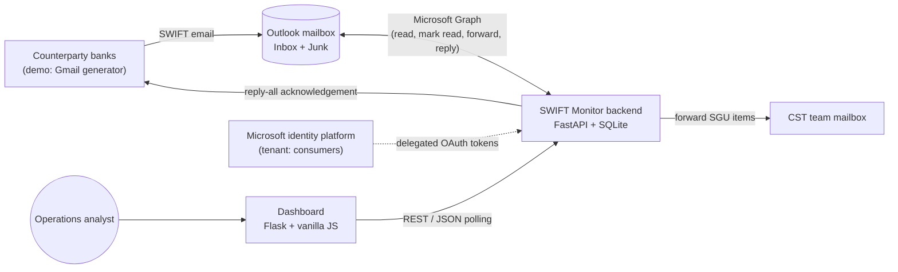
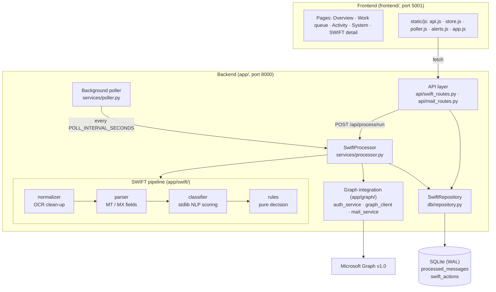
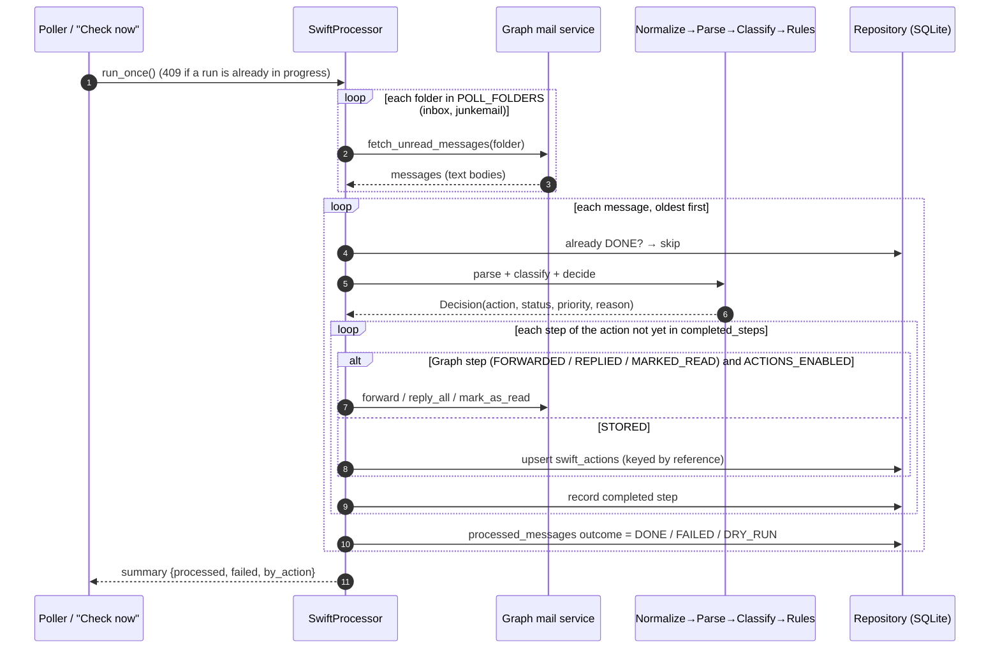
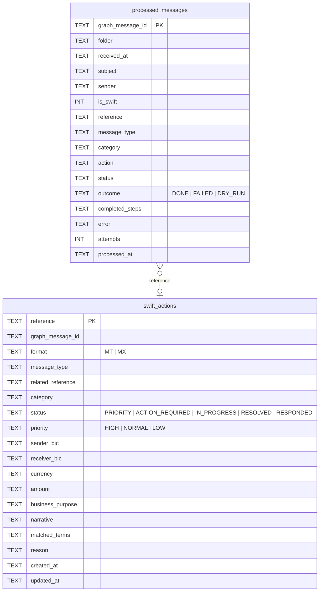
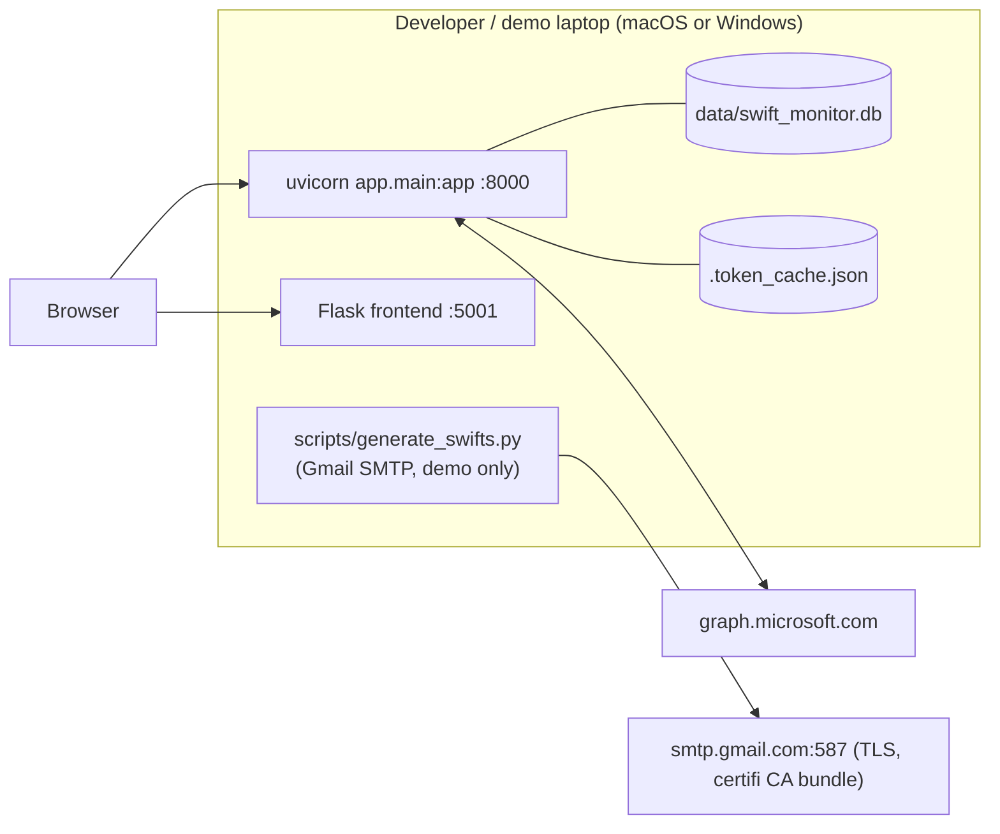

# SWIFT Mailbox Monitor: Solution Architecture

## 1. Purpose

Operations teams receive SWIFT messages (MT and ISO 20022 MX) as emails in a shared Outlook mailbox. Many are routine; a few need an analyst's attention quickly. Triage is currently done by hand.

SWIFT Mailbox Monitor reads the mailbox continuously and does the following for each message:

- **Recognises** it as a SWIFT message, from OCR'd PDF-to-text email bodies.
- **Extracts** the key fields: reference, related reference, message type, BICs, amount, currency and business purpose.
- **Classifies** it as a cancellation, amendment, callback, ABA request or other, using standard-library NLP only.
- **Applies the business rules:** forwards it, auto-replies, marks it read, or stores it for an analyst.
- **Shows** the result on a real-time dashboard with priority alerts and an analyst workflow.

## 2. Business rules

Rules are evaluated in order; the first match wins (`app/swift/rules.py`).

| # | Condition | Action | Resulting status | Priority |
|---|---|---|---|---|
| 1 | Email is not a SWIFT message | Ignore (logged only) | `IGNORED` | Low |
| 2 | Any reference (fields 20/21 or narrative) starts with `SGU` | Forward to the CST team mailbox, then mark read | `ROUTED_CST` | Normal |
| 3 | Cancellation whose MX type is in `CANCELLATION_ACTION_MX_TYPES` (default `camt.056`) | Store for analyst | `ACTION_REQUIRED` | High |
| 4 | Cancellation with strong evidence (MTn92 type, camt.056/058, or explicit phrases) | Mark read (auto-close) | `AUTO_CLOSED` | Low |
| 5 | Cancellation with weak evidence | Store for analyst | `ACTION_REQUIRED` | Normal |
| 6 | Amendment | Store and raise a **priority alert** on the dashboard | `PRIORITY` | High |
| 7 | Callback with an `FT…` or `INV…` reference | Reply-all acknowledgement, store, mark read | `RESPONDED` | Normal |
| 8 | Callback without an FT/INV reference | Store for analyst | `ACTION_REQUIRED` | Normal |
| 9 | ABA / routing-number request | Store for analyst | `ACTION_REQUIRED` | Normal |
| 10 | Any other SWIFT message | Store for analyst | `ACTION_REQUIRED` | Normal |

Analysts then move stored items through `ACTION_REQUIRED` / `PRIORITY` → `IN_PROGRESS` → `RESOLVED` from the dashboard.

## 3. Context

## 4. Logical architecture

### 4.1 Components

| Component | Responsibility | Key files |
|---|---|---|
| **Configuration** | Typed settings from `.env` / environment (pydantic-settings) | `app/config/settings.py` |
| **Auth service** | MSAL public-client app with delegated permissions (`Mail.ReadWrite Mail.Send User.Read`) and a persistent token cache (`.token_cache.json`, file mode 0600). Sign-in uses the device-code flow (`python -m app.cli login`) or the browser redirect (`/auth/login`). Raises `SignInRequiredError` when the cache is empty or expired. | `app/graph/auth_service.py`, `app/cli.py` |
| **Graph client / mail service** | Thin async HTTP wrapper (httpx). Fetches unread mail per folder as text bodies, sorts client-side, and does mark-as-read, forward and reply-all. | `app/graph/graph_client.py`, `app/graph/mail_service.py` |
| **Normalizer** | Repairs OCR artefacts: homoglyphs, broken tags such as `:130:`→`:13C:`, and mangled tokens such as `MpGPSMai1`. | `app/swift/normalizer.py` |
| **Parser** | Detects MT vs MX. Extracts the message type (`MT199`, `camt.056.001.08`), fields 20/21, BICs, 32A amount/currency, narrative (79/72) and MX family. | `app/swift/parser.py` |
| **Classifier** | Standard-library only (`re`, `difflib`, `unicodedata`). Weighted lexicon of phrases, stems and terms, with fuzzy matching for OCR typos, a message-type prior (MTn92, camt.056/058 → cancellation; camt.087 → amendment) and a negation guard ("DO NOT CANCEL"). Outputs category, confidence, matched terms, business purpose and a "strong evidence" flag. | `app/swift/classifier.py` |
| **Rules engine** | Pure function `decide(parsed, classification, action_mx_types)` → `Decision(action, category, status, priority, reason)`. No I/O, so it is trivially testable. | `app/swift/rules.py` |
| **SwiftProcessor** | Orchestrates one run: fetch → parse → classify → decide → execute steps → persist. Idempotent and resumable, with a single-run lock and a dry-run mode. | `app/services/processor.py` |
| **Poller** | Background asyncio task started in the FastAPI lifespan. Runs every `POLL_INTERVAL_SECONDS`; if sign-in is required or a run fails, it logs a warning, skips that poll and tries again on the next interval. | `app/services/poller.py`, `app/main.py` |
| **Repository** | SQLite access in WAL mode, so the API can read while the poller writes. | `app/db/repository.py` |
| **REST API** | Dashboard data, analyst status changes, manual run, processing log, Graph diagnostics, auth endpoints. CORS limited to `FRONTEND_ORIGIN`. | `app/api/*.py` |
| **Frontend** | Flask serves the templates; all data comes from the backend over JSON. Polls every 5 s with backoff to 30 s, raises priority toasts, shows the open-priority count in the tab title, and HTML-escapes all email content. | `frontend/` |

## 5. Processing flow

**Steps per action**

| Action | Ordered steps |
|---|---|
| `FORWARD_TO_CST` | `FORWARDED` → `MARKED_READ` |
| `AUTO_REPLY` | `REPLIED` → `STORED` → `MARKED_READ` |
| `MARK_READ` | `MARKED_READ` |
| `STORE_FOR_ANALYST` | `STORED` (left unread in Outlook) |
| `IGNORE` | none (logged only) |

**Reliability properties**

- **Idempotent:** a message is processed at most once. Unread messages that were already handled, such as stored items, are skipped on later polls.
- **Resumable:** `completed_steps` is persisted after each step. A failure such as Graph returning 503 leaves the message `FAILED`, and the next run retries only the missing steps, so there is never a double forward or reply.
- **Single run at a time:** an async lock prevents the poller and a manual run from overlapping; the API returns `409`.
- **Dry run:** `ACTIONS_ENABLED=false` classifies and stores everything but skips all mailbox side effects (outcome `DRY_RUN`), and the dashboard shows a banner.
- **Sign-in loss:** an expired or missing token raises `SignInRequiredError`; the poller skips the run instead of marking messages as failed, and the dashboard shows "Mailbox not connected".

## 6. Data model

- **`processed_messages`** is the audit log: one row per email seen, SWIFT or not, which feeds the Activity and System views.
- **`swift_actions`** is the work queue: one row per SWIFT reference that needs or had an action, which feeds the Overview, Work queue and Detail views. A later message with the same reference (for example a second amendment) updates the row and re-raises it.

## 7. API surface

| Method | Path | Used by |
|---|---|---|
| GET | `/health` | Liveness |
| GET | `/api/swifts?status=&category=&since=&limit=` | Work queue; `since` supports incremental polling |
| GET | `/api/swifts/alerts` | Open `PRIORITY` items |
| GET | `/api/swifts/metrics` | Overview KPI tiles |
| GET | `/api/swifts/{reference}` | Detail page |
| PATCH | `/api/swifts/{reference}` `{"status": "IN_PROGRESS" \| "RESOLVED"}` | Analyst workflow |
| POST | `/api/process/run` | "Check mailbox now" (409 while a run is active) |
| GET | `/api/process/log?limit=` | Activity log / System view |
| GET | `/api/graph/test-user` | Connection pill (checked at most once a minute) |
| GET | `/api/graph/messages`, `/messages/unread`, `/messages/{id}` | Diagnostics |
| PATCH | `/api/graph/messages/{id}/read` | Diagnostics |
| GET/POST | `/auth/login`, `/auth/callback`, `/auth/logout` | Browser sign-in |

Interactive documentation is served at `/docs` (OpenAPI).

## 8. Frontend architecture

- **Server:** Flask (`frontend/app.py`) renders Jinja templates and injects `SWIFT_API_BASE` (default `http://localhost:8000`). It has no data access of its own.
- **Client:** vanilla JS modules on `window`:
  - `api.js`: fetch wrapper
  - `store.js`: in-memory rows, metrics and activity
  - `poller.js`: 5 s `setTimeout` loop with backoff to 30 s, and an immediate refresh when the tab becomes visible
  - `alerts.js`: toasts, amendment priority toasts and the tab-title counter
  - `app.js`: page renderers and analyst actions
- **Real-time model:** short polling. A new amendment appears as a priority toast plus a dashboard update within about one backend poll interval plus 5 s, with no page reload.
- **Security:** every email-derived value is HTML-escaped or set with `textContent`, and CORS on the backend allows only `FRONTEND_ORIGIN`.
- **Branding:** Société Générale template with a red/black/white palette and an icon rail plus a view selector.

## 9. Deployment view (hackathon / local)

| Setting (`.env`) | Purpose | Default |
|---|---|---|
| `GRAPH_CLIENT_ID`, `GRAPH_TENANT_ID` | Azure app registration; `consumers` for outlook.com accounts | required, `consumers` |
| `SWIFT_MAILBOX` | Mailbox to monitor (`me` = signed-in user) | `me` |
| `POLL_FOLDERS` | Folders to scan | `inbox,junkemail` |
| `POLL_INTERVAL_SECONDS` | Poller cadence | `30` (demo: `10`) |
| `POLLER_ENABLED` / `ACTIONS_ENABLED` | Turn off polling / dry-run mode | `true` / `true` |
| `CST_MAILBOX` | Forward target for SGU references | configured |
| `CANCELLATION_ACTION_MX_TYPES` | MX cancellations that need an analyst | `camt.056` |
| `DATABASE_PATH`, `TOKEN_CACHE_PATH` | Local state | `data/swift_monitor.db`, `.token_cache.json` |
| `FRONTEND_ORIGIN` | CORS allow-list | `http://localhost:5000` (set to `:5001` on macOS) |

**Supporting tooling**

- `scripts/generate_swifts.py`: sends realistic dummy SWIFTs (ten kinds, weighted random, `--auto`, or the six-step `--scenario demo`) to the monitored mailbox to show real-time behaviour.
- `scripts/seed_demo_data.py`: runs synthetic SWIFTs through the real pipeline with an in-memory mailbox into `data/demo.db`. It gives offline frontend development and a demo fallback with no credentials, and `--live` adds a new message every few seconds.
- `tests/`: 427 pytest tests covering normalizer, parser, classifier, rules, processor (idempotency, resume, dry run), API, generator, seed script and frontend routes. Fixtures are anonymised real mailbox samples.

## 10. Security considerations

- **Delegated permissions only** (least privilege for a single mailbox). No client secret: the app is a public client.
- **Local secrets:** the token cache is stored with `0600` permissions, and secrets (`.env`, token cache, `data/`) are git-ignored.
- **Fixtures:** test fixtures have IBANs and names masked.
- **Email content is untrusted:** it is escaped in the UI, and the classifier only reads text, never executes it or follows links.
- **Mailbox writes are constrained:** auto-replies use a fixed template, and forwards go only to the configured CST address.

## 11. Path to production (beyond the hackathon)

| Area | Hackathon choice | Production direction |
|---|---|---|
| Mailbox access | Delegated device-code sign-in, personal outlook.com | Application permissions with an Exchange application access policy scoped to the shared mailbox; certificate credential in a key vault |
| Change detection | Polling every 10–30 s | Graph change notifications (webhooks) + delta queries, polling as a fallback |
| Storage | SQLite file | Managed Postgres / SQL Server; retention policy for message text |
| Real-time UI | 5 s short polling | Server-Sent Events or WebSockets pushed from the processor |
| Hosting | Two local processes | Containerised backend + frontend behind SSO (Entra ID), single origin |
| Classification | Lexicon + rules (explainable, stdlib only) | Keep rules as the decision layer; feed analyst corrections back into the lexicon and track precision/recall per category |
| Observability | Application logs, `/api/process/log` | Structured logs, metrics (latency, failures, queue age) and alerting on `FAILED` / sign-in loss |
